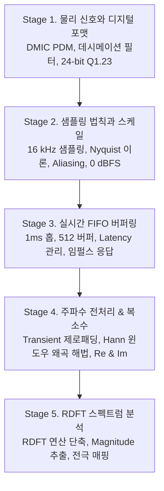

# 🧠 인공와우(Cochlear Implant) 타겟 실무 중심 DSP 마스터 커리큘럼

본 커리큘럼은 **초저전력·초저지연 의료기기인 인공와우(Cochlear Implant, CI) 시스템**을 타겟으로 설계된 디지털 신호처리(DSP) 전문 학습 로드맵입니다. 

디지털 신호처리 기초가 전혀 없는 입문자부터 하드웨어 인터페이스 설계, 실시간 버퍼링 제어, 그리고 저전력 주파수 분석 알고리즘 최적화를 수행할 수 있는 수준까지 유기적으로 이끌어주기 위해 교육 설계 전문가, 하드웨어 엔지니어, 수학 및 알고리즘 스페셜리스트 에이전트의 공동 연구를 거쳐 완성되었습니다.

---

## 🧭 인공와우 타겟 시스템 규격 (Target System Specs)
* **오디오 샘플링 주파수 ($f_s$):** $16\text{ kHz}$ (말소리 인지 최적화, 대역폭 $8\text{ kHz}$)
* **입력 데이터 주기:** $1\text{ ms}$ 마다 $16$개의 샘플이 입력됨.
* **하드웨어 입력 파이프라인:** 디지털 마이크(DMIC) $\to 1$-bit PDM 입력 $\to$ 하드웨어 데시메이션 필터 $\to$ 24-bit Q1.23 고정소수점 PCM 출력.
* **주파수 분석 엔진:** $512$포인트 Real DFT(RDFT) 기반 FFT, Hann 윈도우 적용.
* **실시간 버퍼링 구조:** 홉(Hop) 크기 $16$샘플 ($1\text{ ms}$), 오버랩 $496$샘플 ($96.875\%$ 오버랩 비율), 초기 기동 시 Zero-Padding 기반 실시간 FFT 계속 수행.

---

## 1. 🧭 교육학적 학습 순서 및 교수 전략 (Pedagogical Order & Metaphor)

본 커리큘럼은 입문자가 느낄 수 있는 수학적·하드웨어적 장벽을 무너뜨리기 위해 **"물리 세계의 소리 획득(HW) $\to$ 디지털 세계의 격자 규정(Math) $\to$ 실시간 지연 제어(System) $\to$ 신호의 전처리(DSP) $\to$ 스펙트럼 분석(Algorithm)"**의 물리적 흐름을 따릅니다.

### 5단계 학습 흐름 (Progression Graph)


### 💡 실무 학습 장벽 극복을 위한 5대 비유 (Metaphors)
1. **Q1.23 고정소수점:** **"1달러짜리 자(Ruler)와 838만 개의 눈금"**
   * 인공와우 칩은 전력을 많이 먹는 '소수점 컴퍼스(부동소수점)' 대신 소수점 위치가 고정된 '자'를 씁니다. 맨 앞 $1$비트(Q1)는 부호, 나머지 $23$비트는 소수점 아래 미세 눈금입니다. 딱 $\pm 1.0$달러 범위를 $2^{23}$개의 정밀한 눈금으로 쪼개서 표현합니다. $1$달러를 넘으면 자를 벗어나는 굉음(클리핑)이 납니다.
2. **PDM to PCM 데시메이션:** **"초고속 거수투표(PDM)와 1ms 간격의 대표단 집계(PCM)"**
   * 디지털 마이크가 던지는 $1\text{ MHz}$ 초고속 펄스(0과 1) 스트림을 직접 다루기 어렵기 때문에, $1\text{ ms}$마다 투표율을 정밀히 계산(24비트 PCM)해 주는 전용 하드웨어 필터(반장)가 중간에 위치합니다.
3. **초고밀도 FIFO 오버랩:** **"16명씩 타고 내리는 512인승 열차"**
   * 주파수 해상도를 위해 $32\text{ ms}$(512샘플)의 데이터가 필요하지만, $32\text{ ms}$를 온전히 기다려 처리하면 지연이 발생해 어지럽습니다. 따라서 $512$인승 열차에 매 $1\text{ ms}$마다 가장 오래된 16명을 하차시키고, 새로 들어온 16명을 태운 뒤 즉시 출발(FFT)시킵니다.
4. **초기 제로패딩:** **"승객이 없어도 유령(0)을 태워 즉시 출발시키기"**
   * 전원을 켠 직후, $32\text{ ms}$ 동안 환자를 침묵에 빠뜨릴 수 없습니다. 첫 $1\text{ ms}$(16샘플)가 들어오는 즉시 나머지 496 자리를 $0$으로 채워 열차를 즉각 출발(FFT)시켜 초기 지연을 1ms로 극소화합니다.
5. **Real DFT (RDFT):** **"데칼코마니의 절반만 그리는 저전력 화가"**
   * 마이크 소리는 실수(Real)이므로 주파수 스펙트럼은 항상 양과 음의 주파수가 거울 대칭을 이룹니다. RDFT는 절반의 연산을 생략하여 칩 전력 소비와 메모리를 복소 FFT 대비 50% 줄임으로써 배터리를 극적으로 아낍니다.

---

## 2. 🎛️ Stage 1: 물리 신호와 디지털 포맷 (Digital Capture)

**학습 목표:** 공기 중의 아날로그 음향 신호가 마이크를 거쳐 어떻게 인공와우의 정밀한 Q1.23 PCM 데이터로 변환되어 저장되는지 물리적·하드웨어적 구조를 이해합니다.

### 1.1 DMIC와 PDM (Pulse Density Modulation)
* **MEMS 마이크:** 음압에 의한 정전 용량 변화를 마이크 내장 ASIC이 1비트의 초고속 비교기(Sigma-Delta Modulator)를 거쳐 $1$-bit PDM 펄스열로 출력합니다. 
* **펄스 밀도 변조:** 전압이 높을수록 펄스($1$)의 밀도가 조밀하고, 낮을수록 성깁니다.

### 1.2 Q1.23 고정소수점 (Fixed-Point) 수학
* **정의:** 부호가 있는 2진 이산 소수를 표현하는 방법입니다. $24$-bit 레지스터 상에서 맨 앞 $1$-bit는 부호(Sign), 나머지 $23$-bit는 소수점 아래 영역(Fractional)을 나타냅니다.
* **표현 범위:** $[-1.0, 1 - 2^{-23}]$ (십진수: $-1.0 \sim 0.99999988$)
* **해상도 (Least Significant Bit, LSB):** $2^{-23} \approx 1.192 \times 10^{-7}$
* **연산 장점:** Q1.23 소수 곱셈 연산 시 결과의 절댓값은 항상 $1.0$ 이하로 유지되므로, 곱셈 연산에서는 오버플로우가 원천적으로 발생하지 않습니다.
  $$|x_1| \le 1.0, \ |x_2| \le 1.0 \implies |x_1 \times x_2| \le 1.0$$

### 1.3 하드웨어 데시메이션(Decimation) 최적화
* **전력 최적화 구조:** DSP 코어가 매 샘플마다 깨어나면 전력 소비가 극심합니다. 이를 방지하기 위해 **Dedicated 하드웨어 데시메이션 IP Block**이 탑재되어, 하드웨어가 스스로 변환을 수행한 후 $1\text{ ms}$(16샘플)마다 DMA 인터럽트를 날려 DSP를 깨웁니다.
* **CIC(Cascaded Integrator-Comb) 필터:** 곱셈기 없이 덧셈기와 지연 소자만으로 $1.024\text{ MHz}$ PDM을 64배 다운샘플링하여 $16\text{ kHz}$ 속도로 바꿉니다.
* **보상 FIR 필터:** CIC 필터의 통과대역 주파수 감쇄(Droop)를 보정(Flat Passband)하고, 대칭 계수(Symmetric) 및 절반이 0인 하프밴드(Half-Band) 구조를 활용하여 연산 클럭을 50% 절감합니다.

---

## 3. 📈 Stage 2: 샘플링 법칙과 스케일 (Sampling & Scale)

**학습 목표:** 샘플링 주파수 $16\text{ kHz}$의 결정 요인과 앨리어싱(Aliasing)을 방지하는 주파수 접힘(Folding) 계산을 수행하고, 시스템의 절대 음량 크기 한계인 $0\text{ dBFS}$를 정의합니다.

### 3.1 16 kHz 샘플링 레이트와 말소리 분석
* **나이퀴스트 주파수 ($f_N$):** 
  $$f_N = \frac{f_s}{2} = 8\text{ kHz}$$
* **설계 타당성:** 인간의 가청 대역은 $20\text{ kHz}$이지만, 언어 소통을 위한 음성 성분(Vowel, Formant, Fricatives)은 대부분 $8\text{ kHz}$ 내에 집중됩니다. 샘플링 주파수를 $16\text{ kHz}$로 한정함으로써 배터리 소비를 고음질 규격($48\text{ kHz}$) 대비 **$3$배 이상 감소**시킵니다.

### 3.2 주파수 폴딩 및 Aliasing 계산
* **폴딩 공식:** $f_{in} > f_N$인 신호는 디지털 도메인에서 $f_N$을 경계로 하여 가청 대역 내로 접혀 들어옵니다.
  $$f_{folded} = | f_{in} - N \cdot f_s | \quad (\text{단, } f_{folded} \le 8\text{ kHz})$$
* **예제:** 인공와우 마이크 전단 필터가 $12\text{ kHz}$ 잡음을 완전히 차단하지 못할 경우, 디지털 단에서는 다음과 같이 접혀 가청 잡음으로 들립니다.
  $$f_{folded} = | 12\text{ kHz} - 1 \cdot 16\text{ kHz} | = 4\text{ kHz} \ (\text{가청 대역 중앙에 침범})$$

### 3.3 0 dBFS 풀스케일과 오버플로우 관리
* **기준점:** Q1.23의 절댓값 $1.0$ (최대 레벨)을 **$0\text{ dBFS}$**로 정의합니다.
* **Dynamic Range:** 24비트의 이론적 동적 영역은 약 $146.2\text{ dB}$입니다. 사람의 가청 대역($120\text{ dB}$)을 충분히 덮고도 남습니다.
* **오버플로우 방지 (덧셈 루틴):** 필터 연산 시 덧셈이 중첩되면 Q1.23 한계를 넘어 부호 비트가 깨지는 현상이 발생합니다. 이를 위해 하드웨어는 $48$-bit 또는 $56$-bit의 **Guard Bit Accumulator**를 지원하며, 최종 출력 전 단계에서 적절히 우측 시프트(Right-shift)하거나 포화 연산(Saturation) 처리를 해야 합니다.

---

## 4. ⏳ Stage 3: 실시간 FIFO 버퍼링 (Real-Time Buffer Management)

**학습 목표:** $512$샘플 크기의 주파수 분석 창을 유지하면서 어떻게 $1\text{ ms}$의 초저지연을 실현하는지 메커니즘을 규명하고, 시스템의 기본 DNA인 임펄스 응답(Impulse Response)을 정의합니다.

### 4.1 초저지연 오버랩 슬라이딩 (Hop 16, Overlap 496)
* **512 버퍼와 16 홉:** 주파수 해상도를 확보하려면 512샘플($32\text{ ms}$)이 필요하지만, $32\text{ ms}$를 통째로 모아서 연산하면 입술 모양과 소리가 일치하지 않는 지연감이 발생합니다.
* **해결책 (FIFO sliding):** 메모리 버퍼를 $1\text{ ms}$마다 갱신하는 FIFO 링버퍼로 구성합니다.

```
[ 매 1ms마다 일어나는 버퍼 변화 ]
Frame N:   |-- [1ms/16샘플] --|----------------------- 496샘플 (이전 데이터) -----------------------|
             (오래된 16샘플 방출)  <- FIFO 왼쪽 시프트
Frame N+1: |----------------------- 496샘플 (이전 데이터) -----------------------|-- [신규 16샘플] --|
```
* **오버랩 비율:** 
  $$\text{Overlap Ratio} = \frac{512 - 16}{512} \times 100\% = 96.875\%$$
  이 초고밀도 오버랩은 시간 축에서 에너지가 아주 빠르게 변하는 말소리 신호의 과도기 성분(Onset)을 1ms 단위의 정밀도로 실시간 추적할 수 있게 합니다.

### 4.2 지연(Latency)의 물리적 한계와 비대칭 윈도우
* **블록 지연 (Block Latency):** 매 1ms 마다 인터럽트가 돌며 계산되므로, 신규 데이터 수집 대기 시간은 **$1\text{ ms}$**로 제한됩니다.
* **그룹 지연 (Group Delay):**
  대칭형 윈도우(예: 일반 Hann)의 경우, 피크점(가중치 최대)이 중심인 $N/2 = 256$ 샘플 지점에 위치합니다. 이로 인해 분석 지연이 물리적으로 발생합니다.
  $$\text{Latency}_{\text{group}} = \frac{N}{2 \cdot f_s} = \frac{256}{16,000\text{ Hz}} = 16\text{ ms}$$
* **인공와우 실무 해법:** $16\text{ ms}$의 지연은 환자의 청각 인지에 큰 장애가 되므로, 실무에서는 창의 중심이 오른쪽(최신 데이터 방향)으로 치우친 **비대칭 윈도우(Asymmetric Window)**를 설계 적용하여 그룹 지연을 $4 \sim 8\text{ ms}$ 수준으로 감축시킵니다.

### 4.3 시스템의 DNA: 임펄스 응답
* **개념:** 인공와우 디지털 필터에 가상의 임펄스(단일 펄스 $x[0]=1.0$, 나머지 0)를 입력했을 때 나오는 출력 파형 $h[n]$입니다.
* **의의:** 이 $h[n]$에 모든 주파수 성분이 균일하게 들어있으므로, $h[n]$만 알면 필터의 특성을 완벽히 파악할 수 있으며 임의의 입력 신호와 $h[n]$ 간의 **컨볼루션(Convolution)**으로 최종 출력을 유도할 수 있습니다.

---

## 5. 🌊 Stage 4: 주파수 전처리 & 복소 공간 (Preprocessing & Complex Dimension)

**학습 목표:** 시스템 기동 초기 상태(Transient Phase)의 연산 지연 방지를 위한 제로패딩의 효과와 윈도우 곱셈 시의 왜곡 해법을 파악하고, 복소 공간 좌표(Re, Im)의 기하학적 의미를 마스터합니다.

### 5.1 초기 과도기(Transient Phase)와 제로패딩 (Zero-Padding)
* **목표:** 전원을 켠 순간 512샘플이 찰 때까지 $32\text{ ms}$를 무조건 대기하는 지연을 방지해야 합니다.
* **동작:** 첫 $1\text{ ms}$에는 유효 신호 $16$개만 존재하며, 나머지 $496$개 버퍼 영역은 전부 $0$으로 강제 입력(Zero-Padding)한 뒤 즉시 512-point FFT를 수행합니다.
* **수학적 영향:** 제로패딩을 하면 16개의 신호가 주파수 도메인 상에서 촘촘히 보간(Spectral Interpolation)되어 매끄러운 곡선으로 나타납니다. 다만, 물리적인 주파수 해상도는 유효 샘플 길이인 $16$샘플(해상도: $16\text{ kHz}/16 = 1\text{ kHz}$)을 기준으로 결정됩니다.

### 5.2 과도기 상태에서의 Hann 윈도우 왜곡과 해법
* **문제점:** 512포인트 Hann 윈도우 $w[n]$은 양 끝($n \approx 0$ 부근)의 값이 거의 0에 가깝습니다.
  $$w[n] = 0.5 \left(1 - \cos\left(\frac{2\pi n}{512}\right)\right)$$
  초기 과도기(예: 첫 $1\text{ ms}$)에는 신호가 버퍼의 극초반(인덱스 $0 \sim 15$)에만 들어있으므로, Hann 윈도우를 곱해버리면 유효한 신호 성분이 윈도우의 테이퍼링(Tapering) 효과에 의해 **거의 $0$으로 죽어버려 에너지가 소멸하는 심각한 신호 왜곡**이 발생합니다.
* **실무적 해법:** 
  1. **초기 직사각형 윈도우 우회 (Bypass):** 유효 샘플 개수 $M$이 일정 크기(예: $128$개) 미만인 초기 1~7ms 동안은 Hann 윈도우를 적용하지 않고 곱셈 가중치를 $1$로 고정하며, 샘플 크기 증가에 비례하여 크기 보정 계수(Normalization Scale)만 곱해준 뒤 제로패딩합니다.
  2. **가변 길이 Hann 윈도우 (Dynamic Windowing):** 유효 데이터 개수 $M$에 맞춘 동적 Hann 윈도우 $w_M[n]$을 매 프레임별로 짧게 계산하여 곱한 후 제로패딩을 수행하고, 에너지 감쇄를 방지하기 위해 가중치의 역수를 보정합니다.

### 5.3 복소 공간 (Real & Imaginary)의 기하학
* **회전 벡터:** 푸리에 분석에서 주파수는 2차원 원평면을 회전하는 벡터로 표현됩니다.
  * **실수부 (Re):** 코사인(Cosine) 성분과의 상관성.
  * **허수부 (Im):** 사인(Sine) 성분과의 상관성.
* 위상(시간의 시작 시점)이 변함에 따라 두 개별 값은 끊임없이 변화하지만, 이들의 기하학적 화살표 길이인 **Magnitude**는 일정하게 유지됩니다.

---

## 6. ⚡ Stage 5: RDFT 스펙트럼 분석 (Energy Extraction)

**학습 목표:** 저전력 칩 설계에 핵심이 되는 실수 최적화 FFT(RDFT)의 효율성을 계산하고, 크기(Magnitude) 연산을 통해 최종 인공와우 전극 채널 자극 데이터를 도출하는 알고리즘을 완벽히 마스터합니다.

### 6.1 Real DFT (RDFT)의 수학적 연산 단축 원리
* **Conjugate Symmetry:** 실수 입력 신호 $x[n]$의 DFT 출력 $X[k]$는 다음과 같은 켤레 대칭 관계를 가집니다.
  $$X[N-k] = X^*[k] \quad (*\text{는 복소 공액})$$
* **연산 효율 최적화:** 굳이 $512$개의 주파수 출력을 다 연산할 필요가 없이, $0 \sim 256$번째 인덱스($257$개) 정보만 구하면 나머지 뒤쪽 영역은 완벽한 거울 대칭이므로 계산을 생략합니다.
* **메모리 및 MAC 클럭 50% 감축:**
  $512$점 실수 신호를 짝수/홀수 인덱스로 나누어 **$256$점 복소 FFT**로 변환한 후, $O(N)$ 연산량의 간단한 Unpacking 처리를 거칩니다. Radix-2 복소 FFT 대비 곱셈 횟수가 거의 절반인 **$1,024$회 복소 곱셈** 수준으로 감소하여, 배터리 수명을 대폭 향상시킵니다.

### 6.2 복소 크기 (Magnitude) 및 전극 자극 매핑
* **수식:** 
  $$\text{Magnitude } |X[k]| = \sqrt{Re(X[k])^2 + Im(X[k])^2}$$
* **인공와우 전극 맵핑 (CIS 알고리즘 기초):**
  $257$개의 주파수 빈(Bin)의 에너지를 전극 개수(예: $16 \sim 22$개 채널)에 맞춰 주파수 밴드 대역별로 통합(Bin Binning)합니다. 통합된 밴드 에너지는 로그 스케일 압축(사람의 대수적 음량 감각 반영)을 거친 후, 해당 주파수를 담당하는 전극에 전기 펄스 전류 크기로 변환되어 내보내집니다.

```
       [ 257개 RDFT Bin 데이터 ]
                  |
     +------------+------------+
     | (Binning / Band-pass 묶기)
     v
[ 밴드 1 ]    [ 밴드 2 ] ... [ 밴드 22 ]   -> 22개 대역 채널 에너지 추출
     |            |              |
     +------------+------------+
     | (로그 압축 & 전류 매핑)
     v
[ 전극 1 ]    [ 전극 2 ] ... [ 전극 22 ]   -> 청신경 전기 자극 (Cochlear Stimulation)
```

---

## 🛠️ 인공와우 사양 특화 실무 프로젝트 (CI Practicums)

### 📌 [Project 1] Q1.23 고정소수점 변환 및 IIR/FIR 오버플로우 시뮬레이터 (Stage 1~2)
* **과제:** float 오디오 데이터를 24비트 정밀도의 Q1.23 고정소수점 2진수로 변환하고, 1ms 16샘플 단위 입력 스트림에 대해 덧셈 중첩 시의 오버플로우 현상을 관측합니다. Accumulator Guard Bit가 있는 연산과 없는 연산 시의 클리핑 잡음 왜곡 차이를 비교 분석해 봅니다.

### 📌 [Project 2] C 기반 1ms 홉/512 버퍼 실시간 FIFO 링버퍼 설계 (Stage 3)
* **과제:** C언어 또는 고정소수점 Python 구조를 활용하여 1ms(16샘플)마다 새로운 데이터가 들어오고, 이전 496샘플이 왼쪽으로 슬라이딩되는 오버랩 세이브 링버퍼(Ring Buffer) 모듈을 구현합니다.

### 📌 [Project 3] 과도기(Transient Phase) 전처리 및 윈도우 보정기 작성 (Stage 4)
* **과제:** FFT 512 버퍼가 다 차기 전(초기 기동 1ms~31ms) 상태를 시뮬레이션하고, 일반 512 Hann 윈도우 적용 시 발생하는 신호 에너지 증발 현상을 실증합니다. 이를 해결하기 위한 '초기 직사각형 윈도우 우회법' 및 '에너지 보정 계수 곱셈기'를 구현하여 과도기 왜곡을 차단하는 알고리즘을 코드로 구현합니다.

### 📌 [Project 4] 실수 최적화 RDFT 및 밴드별 에너지 추출기 구현 (Stage 5)
* **과제:** $512$점 실수 오디오 버퍼에 대해 256점 복소 FFT를 이용해 고속 처리하는 RDFT 함수를 작성하고, 각 주파수 빈의 크기(Magnitude) 값을 구한 뒤, 16개 채널 밴드 패스 필터 뱅크와 연동하여 채널별 자극 세기 값을 계산해 내는 최종 시뮬레이터를 구현합니다.
