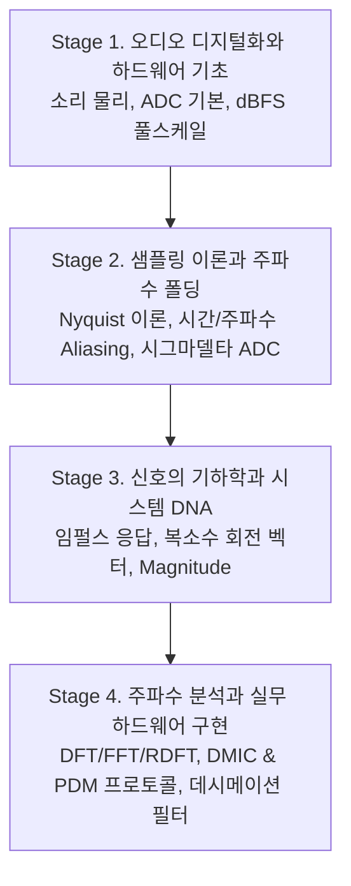
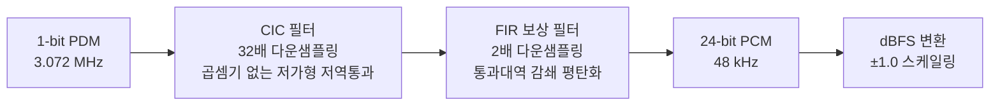

# 📡 초보자부터 전문가까지: 디지털 신호처리 (DSP) 마스터 커리큘럼

이 문서는 디지털 신호처리(DSP) 지식이 전혀 없는 입문자부터 하드웨어 인터페이스 설계 및 고속 알고리즘 최적화를 수행할 수 있는 전문가 수준까지 도달하기 위한 단계별 종합 학습 로드맵입니다. 

교육 설계 전문가, 하드웨어 엔지니어, 수학 및 알고리즘 스페셜리스트 에이전트 간의 공동 연구 및 토론을 거쳐, 개념적 비유(Metaphor)와 시각 자료(Mermaid 및 SVG), 그리고 실무 프로젝트를 유기적으로 통합하여 설계되었습니다.

---

## 🧭 커리큘럼 아키텍처 (Roadmap at a Glance)

본 커리큘럼은 **"구체적인 물리 세계(하드웨어)에서 추상적인 수학(알고리즘)으로"**, 그리고 **"시간 영역에서 주파수 영역으로"** 단계별로 확장하도록 구성되었습니다.



---

## 1. Stage 1: 오디오 디지털화와 하드웨어 기초 (Beginner Level)

**학습 목표:** 소리가 어떻게 컴퓨터 내부의 숫자로 들어오는지 이해하고, 디지털 영역에서 음량의 크기와 한계를 정의할 수 있습니다.

### 1.1 소리에서 전압으로 (Acoustic to Voltage)
* **물리적 작동 원리 (MEMS Mic):**
  공기 입자의 밀도 변화(음압)가 실리콘 다이어프램(MEMS Diaphragm)을 진동시킵니다. 이 진동에 의해 고정 전극판과의 간격이 변하면서 **정전 용량(Capacitance)의 변화**가 생기며, 이를 내장 ASIC 회로가 미세한 **아날로그 전압(Voltage)**으로 증폭합니다.

### 1.2 아날로그-디지털 변환기 (ADC) 기초
* **SAR 및 Flash ADC의 정밀도:**
  연속적인 아날로그 전압을 특정 간격(양자화 레벨)으로 나누어 2진수(0과 1) 디지털 코드로 매핑합니다.
  * **양자화 오류 (Quantization Noise):** 연속 신호를 이산 숫자로 바꿀 때 생기는 버림/반올림 오차로, 백색 잡음(White Noise) 형태로 오디오 신호에 섞입니다.
  * **이론적 동적 영역 (Dynamic Range):** 
    $$\text{Dynamic Range (dB)} \approx 6.02 \times B + 1.76 \quad (\text{단, } B = \text{비트 심도})$$
    (예: 16-bit 오디오는 약 $96\text{ dB}$, 24-bit 오디오는 약 $144\text{ dB}$의 동적 대역폭을 가짐)

### 1.3 디지털 풀스케일 (dBFS - Decibels relative to Full Scale)
* **개념 비유 (물탱크의 비유):**
  디지털 오디오에서 쓸 수 있는 최대 볼륨은 물이 가득 찬 물탱크의 높이인 **0 dBFS**입니다. 이 한계를 넘어 신호가 커지면 물이 넘쳐 흐르듯이 데이터가 잘려 나가는 **디지털 클리핑 (Clipping/Distortion)**이 발생합니다.
* **마이너스 스케일:** 
  따라서 모든 정상적인 디지털 오디오의 신호 크기는 0보다 작은 음수(예: $-12\text{ dBFS}$, $-40\text{ dBFS}$)로 표기됩니다.
* **dBFS 계산식:**
  $$\text{dBFS} = 20 \log_{10} \left( \frac{|x|}{x_{max}} \right)$$

```
  0 dBFS +-----------------------------+  <-- 최대 제한 (물이 가득 참. 클리핑 임계점)
         |                             |
 -6 dBFS |   ~~~~~~ 신호 파형 ~~~~~~~  |  <-- 일반적인 오디오 신호 대역 (헤드룸 존재)
         |                             |
-96 dBFS +-----------------------------+  <-- 16비트 오디오의 바닥 (양자화 잡음 한계)
```

---

## 2. Stage 2: 샘플링 이론과 주파수 폴딩 (Intermediate Level)

**학습 목표:** 아날로그 신호를 얼마나 자주 관측(샘플링)해야 하는지 배우고, 그 한계를 넘을 때 시각/청각 도메인에서 어떤 왜곡(폴딩)이 일어나는지 수학적·직관적으로 이해합니다.

### 2.1 나이퀴스트 샘플링 이론 (Nyquist Theorem)
* **개념 비유 (강물 퍼 담기):**
  흐르는 강물을 초당 몇 번 양동이로 퍼내어 측정해야 원래 물결을 완벽하게 재구성할 수 있을까요? 최소한 물결의 가장 빠른 진동 주기보다 2배 이상 빠르게 샘플을 채취해야 합니다.
* **공식:** 
  $$f_s > 2 \cdot f_{max} \quad (\text{샘플링 주파수 } f_s > \text{최고 주파수 } f_{max} \text{의 2배})$$
* **나이퀴스트 주파수 ($f_N$):** 
  $$f_N = \frac{f_s}{2}$$
  디지털 시스템이 분석하거나 표현할 수 있는 물리적 최대 주파수 한계선(폴딩 주파수)입니다.

### 2.2 시간 도메인에서의 주파수 폴딩: 마차 바퀴 현상 (Wagon Wheel Effect)
* **시간축 왜곡 (Aliasing):**
  영화(24 fps로 샘플링된 시간축 신호)에서 달리는 마차의 바퀴살이 멈춰 서 있거나 거꾸로 회전하는 것처럼 보이는 착시입니다.
* **원인:** 바퀴의 회전 속도($f_{in}$)가 카메라 프레임 속도($f_s$)의 절반인 나이퀴스트 한계($f_s/2$)를 초과하면, 이산 시점들에서 찍힌 정보가 뇌에서 실제보다 훨씬 낮은 주파수($f_{folded}$)의 반대 회전 방향으로 오인되어 합성되기 때문입니다.

### 2.3 주파수 도메인에서의 주파수 폴딩: 아코디언 폴딩
* **병풍/아코디언 비유:**
  나이퀴스트 주파수($f_s/2$) 선을 축으로 하여 주파수 평면을 데칼코마니처럼 접는 것입니다. 고주파 신호가 경계선에서 접혀서 가청 대역(0 ~ $f_s/2$) 내의 엉뚱한 저주파 신호(Aliased Signal)로 침범합니다.
* **폴딩 주파수 계산 공식:**
  $$f_{folded} = | f_{in} - N \cdot f_s | \quad (\text{단, } N\text{은 } f_{folded} \le \frac{f_s}{2}\text{를 만족하는 정수})$$

```
          1st Zone    |    2nd Zone    |    3rd Zone
         (가청 대역)   |   (폴딩 반사)  |   (정방향 반사)
   0                 fs/2              fs              3fs/2
   +------------------+----------------+----------------+
   | (정방향 신호)    | (거울상 반사)   | (정방향 폴딩)   |
   |   40 MHz ------->|                |                |
   |                  |<------ 60 MHz  |                |
   |   <--------------+                |                |
   |   (40 MHz로 보임) |                |                |
```

### 2.4 시그마델타 ($\Sigma-\Delta$) ADC와 오버샘플링
* **오버샘플링 (OSR - Oversampling Ratio):**
  가청 대역 최고 주파수보다 수십~수백 배 빠른 속도로 신호를 무식하게 샘플링하는 기법입니다. 양자화 노이즈를 아주 넓은 주파수 대역으로 골고루 퍼뜨려 밀도를 낮춥니다.
* **노이즈 셰이핑 (Noise Shaping - 방 청소 비유):**
  방 안의 먼지(양자화 노이즈)를 우리가 밟지 않는 가구 밑(가청 대역 밖의 초음파 영역, $20\text{ kHz}$ 이상)으로 빗자루질하여 구석으로 밀어 버리는 기술입니다. 가청 영역은 매우 깨끗해집니다.
* **1비트 양자화기 루프:**
  차이를 누적하여 적분하는 $\Sigma$(Sigma) 루프와 피드백을 통해 노이즈를 고주파로 날려 보내는 $\Delta$(Delta) 회로로 구성되어 있습니다.

---

## 3. Stage 3: 신호의 기하학과 시스템 DNA (Advanced Level)

**학습 목표:** 복잡한 신호 분석으로 나아가기 전, 시스템을 정의하는 가장 단순한 신호를 이해하고, 위상과 에너지를 기하학적으로 처리하는 복소 공간 수학을 정복합니다.

### 3.1 시스템의 DNA: 임펄스 (Impulse) & 임펄스 응답
* **개념 비유 (성당에서의 박수 소리):**
  울림이 심한 성당 안에서 손뼉을 단 한 번 "짝!" 하고 아주 강하고 짧게 치면, 성당 전체로 퍼지는 반사음과 에코를 들을 수 있습니다. 이때 짧은 박수 소리는 **임펄스(시간폭 0, 높이 1인 신호)**이고, 이후 퍼지는 잔향음은 **임펄스 응답(Impulse Response)**입니다.
* **모든 주파수의 통합:**
  수학적으로 완벽한 이산 임펄스 $\delta[n]$은 주파수 영역에서 모든 주파수 성분을 $1$이라는 같은 세기로 품고 있습니다. 따라서 임펄스를 입력하는 것은 **모든 주파수 성분으로 시스템을 동시에 자극하는 행위**와 같습니다.
* **시스템 분석:** 
  어떤 디지털 필터나 음향 공간의 임펄스 응답 $h[n]$만 손에 쥐고 있다면, 임의의 소리 $x[n]$과의 **컨볼루션 합(Convolution Sum)**을 통해 시스템의 최종 출력을 완벽하게 예측할 수 있습니다.
  $$y[n] = x[n] * h[n] = \sum_{k=-\infty}^{\infty} x[k]h[n-k]$$

### 3.2 복소수와 회전 벡터 (Real & Imaginary: Re + Im)
* **개념 비유 (시계 바늘의 회전):**
  정면에서 보면 시계 바늘이 위아래로만 요동치는 것처럼 보이고(사인파), 밑에서 올려다보면 좌우로만 요동치는 것처럼 보입니다(코사인파). 바퀴의 정확한 각도(위상)와 움직임을 벡터 하나로 명확히 추적하려면 실수축(Cosine)과 허수축(Sine)을 결합한 2차원 평면이 필요합니다.
* **오일러 공식 (Euler's Formula):**
  $$e^{j\theta} = \cos\theta + j\sin\theta \quad (j = \sqrt{-1})$$
  삼각함수 곱셈과 각도 제어를 복소 지수 법칙의 덧셈으로 우아하게 처리하기 위해 복소수가 도입됩니다.

### 3.3 복소 크기 계산 (Magnitude)
* **개념 비유 (피타고라스 정리):**
  복소 평면 상에서 회전하는 화살표의 **길이(길이 = 소리의 진폭/볼륨)**입니다.
* **공식:**
  $$\text{Magnitude} = \sqrt{Re^2 + Im^2}$$
* **위상 독립성:** 
  신호의 실수부($Re$)와 허수부($Im$)는 신호가 아주 미세하게 이동해도 값이 주기적으로 계속 변합니다. 하지만 이 두 값을 제곱하여 더하고 루트를 씌우면, 신호의 시간 이동(위상 변화)과 상관없이 해당 주파수가 가진 **순수한 에너지(진폭)**를 안정적으로 추출해 낼 수 있습니다.

```
       Imaginary (Sine축)
             ^
             |       * 복소수 Z = Re + j*Im
             |      /|
  Magnitude  |     / |
   (길이)    |    /  | 허수부 (Im)
             |   /   |
             |  / θ  |
             +-------+------------> Real (Cosine축)
               실수부 (Re)
```

---

## 4. Stage 4: 주파수 분석과 실무 하드웨어 구현 (Expert Level)

**학습 목표:** 소리를 성분별로 해체하는 푸리에 이론들을 마스터하고, 현업에서 디지털 마이크 센서를 마이크로컨트롤러에 직접 붙여 고음질 PCM 음원으로 변환 및 복소 변환하는 시스템을 구축합니다.

### 4.1 푸리에 분석 삼형제 (DFT, FFT, RDFT)
* **개념 비유 (스무디 분석기):**
  시간축 신호는 갖가지 과일이 섞인 **스무디**입니다. 푸리에 변환은 스무디를 분석하여 **"딸기 30%, 바나나 50%, 우유 20%"**라는 주파수별 성분 표(레시피)를 인쇄해 줍니다. 
  반대로 역푸리에 변환(IFFT)은 레시피대로 재료를 넣고 믹서기를 돌려 원래의 스무디(시간축 파형)로 돌려놓는 과정입니다.
* **DFT (Discrete Fourier Transform):**
  입력 신호 $x[n]$과 특정 속도로 회전하는 복소 기저 벡터와의 내적(상관관계)을 직접 비교하는 알고리즘입니다. (연산 속도: $O(N^2)$)
  $$X[k] = \sum_{n=0}^{N-1} x[n] e^{-j \frac{2\pi}{N} k n}$$
* **FFT (Fast Fourier Transform):**
  주기성과 대칭성을 이용해 짝수 인덱스와 홀수 인덱스를 반씩 쪼개어 중복 연산을 극적으로 줄이는 분할 정복(Divide-and-Conquer) 알고리즘입니다. (연산 속도: $O(N \log N)$)
* **RDFT (Real-valued DFT - 실수 최적화):**
  현실의 아날로그 소리 신호는 허수부가 없는 오직 **실수(Real)** 데이터입니다. 실수 신호를 변환하면 주파수 결과 또한 나이퀴스트 경계 기준 완벽한 거울 대칭(공액 대칭성, Conjugate Symmetry: $X[N-k] = X^*[k]$)을 이룹니다. RDFT는 대칭되는 뒷부분을 연산과 메모리에서 과감히 삭제하여 **메모리를 절반으로 아끼고 속도를 2배 빠르게 최적화**합니다.

```
                  [ 복소 FFT ]
  Real Data (N개)  ---------->  연산 리소스 100% 소모  ---> 거울 대칭 중복 데이터 출력 (N개)
  Imaginary (All 0)
  
                  [ 실수 RDFT ]
  Real Data (N개)  ---------->  연산 리소스 50% 소모  ----> 대칭 생략 실속 스펙트럼 출력 (N/2 + 1개)
```

### 4.2 디지털 마이크 (DMIC) & PDM 프로토콜 인터페이스 실무
* **PDM (Pulse Density Modulation) 통신:**
  디지털 MEMS 마이크는 내부에 매우 작은 시그마델타 변조기가 포함되어 있어, 아날로그 신호를 1비트 고속 펄스 열로 변환해 내보냅니다. 값이 큰 구간은 펄스의 밀도가 촘촘하고, 값이 작은 구간은 펄스가 듬성듬성 나옵니다.
* **2채널 DDR 멀티플렉싱 하드웨어 배선:**
  클럭(CLK) 라인과 데이터(DATA) 라인 하나를 두 개의 마이크(좌/우)가 공유합니다. 
  * **왼쪽 마이크 (SELECT -> GND):** 클럭의 **상승 엣지(Rising Edge)**에 데이터 버스에 신호를 싣고 하강 엣지에는 손을 뗍니다(Hi-Z 상태).
  * **오른쪽 마이크 (SELECT -> VDD):** 클럭의 **하강 엣지(Falling Edge)**에 데이터 버스에 신호를 싣고 상승 엣지에는 손을 뗍니다.

```
  Host (DSP/MCU)                   Left Mic (SELECT=GND)
   [ CLK Out ]   ===============>   [ CLK In ]
   [ DATA In ]   <===+===========   [ DATA Out (Rising Edge) ]
                     |
                     |             Right Mic (SELECT=VDD)
                     +===========   [ DATA Out (Falling Edge) ]
```

### 4.3 PDM to PCM 데시메이션 필터 파이프라인
호스트 프로세서는 초고속 1비트 PDM 스트림($3.072\text{ MHz}$)을 우리가 쓸 수 있는 일반적인 멀티비트 오디오 신호(예: $48\text{ kHz}$ 24-bit PCM)로 낮추기 위해 하드웨어 또는 소프트웨어 필터 체인을 구동합니다.



1. **CIC (Cascaded Integrator-Comb) 필터:**
   * 초고속 영역에서 복잡한 소수점 곱셈 연산 없이 덧셈기와 빼기만으로 연산할 수 있는 구조입니다. 샘플 레이트를 32배나 64배로 획기적으로 낮춥니다.
   * *부작용:* 통과시키고자 하는 오디오 영역대(Passband)의 고주파 부분이 뭉툭하게 깎여 나가는 현상(Passband Droop)이 생깁니다.
2. **FIR 보상 필터 (Compensation FIR):**
   * CIC 필터가 깎아 먹은 고주파 대역을 다시 평평하게 올려주는 부스트 필터링 및 추가 2배 데시메이션을 담당하여 최종 타겟 주파수($48\text{ kHz}$)와 플랫한 주파수 특성을 가진 24비트 정밀 음원을 완성합니다.

---

## 🛠️ 추천 레벨별 실무 과제 (Practicum & Challenges)

### **[Level 1 입문] dBFS 미터기 및 클리핑 검출기 개발**
* **과제:** 실시간 아날로그 전압 어레이 데이터를 입력받아 dBFS 단위의 크기로 변환하고, 신호가 $0\text{ dBFS}$를 넘어 소리가 깨지는(clipping) 지점과 횟수를 실시간으로 분석해 콘솔에 표시하는 프로그램을 언어(C/Python/JS)에 무관하게 순수 공식으로 작성합니다.

### **[Level 2 초급] 주파수 폴딩 시뮬레이터 작성**
* **과제:** 샘플링 주파수 $f_s$와 원래 입력 주파수 $f_{in}$을 다르게 지정했을 때, 나이퀴스트 한계 초과로 인해 생성되는 앨리어스 주파수를 폴딩 계산 공식에 의해 예측하고, 이를 사운드로 변환하여 음질 열화 현상을 직접 들어보는 시뮬레이터를 작성합니다.

### **[Level 3 중급] 순수 수학으로만 푸리에 변환 구현하기**
* **과제:** 넘파이(NumPy)나 외부 수학 라이브러리를 일절 쓰지 않고, 순수한 `for` 루프와 삼각함수 라이브러리(`cos`, `sin`)만을 활용하여 $O(N^2)$ 성능의 DFT(이산 푸리에 변환) 함수와 신호 복원용 IDFT 함수를 바닥부터 빌드하고 복소 크기(Magnitude) 값을 정확하게 연산해 봅니다.

### **[Level 4 고급] C언어 기반 Radix-2 DIT FFT 버터플라이 & RDFT 성능 분석**
* **과제:** C언어를 이용해 데이터 개수가 $2^k$개인 배열을 비트 역전(Bit Reversal) 인덱싱 기법으로 재배열한 후, 회전 인자(Twiddle Factor)의 대칭 구조를 이용해 삼각함수 곱셈 결과를 재활용하는 고속 푸리에 변환(FFT) 버터플라이 알고리즘을 소스코드로 직접 작성합니다. 
* 실수 오디오 버퍼에 대해 일반 복소 FFT와 실수 최적화 RDFT 알고리즘을 각각 돌려보고 프로세서의 사이클 타임이나 하드웨어 타이머로 밀리초(ms) 단위의 성능 차이를 측정 보고서로 작성합니다.
