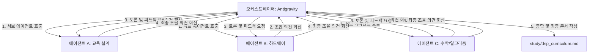

# 초보자부터 전문가까지: DSP 마스터 커리큘럼 구축 계획서

이 계획서는 디지털 신호처리(DSP) 지식이 전혀 없는 입문자부터 전문가 수준까지 성장할 수 있는 체계적인 커리큘럼을 설계하는 계획입니다. 사용자 요청에 따라 단독 작성이 아닌 **멀티 에이전트 협업 시스템**을 구축하여 토론과 상호 보완 과정을 거쳐 고품질의 결과 문서를 도출합니다.

---

## 1. 멀티 에이전트 구성 (역할 분담)

커리큘럼의 체계성과 깊이를 극대화하기 위해 3개의 전문 에이전트를 소환하여 협업을 진행합니다.

1. **에이전트 A: 교육 설계 전문가 (Curriculum Pedagogy Specialist)**
   - **역할:** 비전공자/초보자가 좌절하지 않고 하드웨어와 수학적 개념을 단계별로 습득할 수 있는 최적의 학습 로드맵(단계 구성 및 난이도 조절)을 설계합니다.
2. **에이전트 B: 하드웨어 및 오디오 DSP 전문가 (Hardware & Audio DSP Engineer)**
   - **역할:** 디지털 마이크, DMIC, PDM 프로토콜, ADC 및 시그마델타 ADC, 디지털 풀스케일(dBFS) 등 하드웨어 연동 및 오디오 신호 입력 프로세스에 대한 전문 지식 반영을 담당합니다.
3. **에이전트 C: 수학 및 알고리즘 DSP 전문가 (Math & Algorithm DSP Specialist)**
   - **역할:** 이산 푸리에 변환(DFT), 고속 푸리에 변환(FFT), 실수부/허수부(Re+Im), 복소수 크기 계산(Magnitude), 임펄스 응답 등 디지털 영역에서의 신호 변환 및 연산 알고리즘의 개념 구조 설계를 담당합니다.

---

## 2. 협업 및 토론 프로세스

1. **초안 발송 및 의견 청취:** 오케스트레이터(나)가 서브 에이전트들을 호출하여 각 부문별 필수 개념과 배치 순서에 대한 의견을 구합니다.
2. **토론 및 상호 검토:** 취합된 의견을 바탕으로 에이전트 간 크로스 체크를 진행합니다. (예: "하드웨어 전문가의 PDM 설명 시점이 교육 설계 전문가의 수학적 변환 학습보다 앞에 와야 하는가?" 등)
3. **최종 통합 및 문서 작성:** 조율된 최종 안을 바탕으로 프로젝트 루트 밑의 [study/dsp_curriculum.md](file:///mnt/e/ai/study/dsp_curriculum.md)에 정밀하고 세부적인 커리큘럼 가이드를 작성합니다.

---

## 3. 커리큘럼에 반드시 포함될 핵심 키워드

* **하드웨어 영역:** 디지털 마이크, DMIC 프로토콜, PDM(Pulse Density Modulation), ADC(Analog to Digital Converter), 시그마델타($\Sigma-\Delta$) ADC.
* **디지털 스케일 영역:** 디지털 풀스케일 (dBFS, Full Scale) 개념과 오버플로우 방지.
* **신호 샘플링 이론:** 나이퀴스트 샘플링 이론, 주파수 폴딩(Aliasing/Folding)의 물리적·주파수 도메인 원리.
* **푸리에 변환 및 수학:** DFT(이산 푸리에 변환), FFT(고속 푸리에 변환), RDFT(실수 푸리에 변환), IDFT/IFFT(역변환), 실수부(Re)와 허수부(Im), 복소수 크기(Magnitude, $\sqrt{Re^2 + Im^2}$).
* **시스템 분석:** 임펄스(Impulse) 신호 및 임펄스 응답.

---

## 4. 결과 문서 경로

* **[NEW] [dsp_curriculum.md](file:///mnt/e/ai/study/dsp_curriculum.md):** 최종 협의된 로드맵 및 단계별 실무 학습 내용 정리 문서.
* **[README.md](file:///mnt/e/ai/README.md) 및 [_sidebar.md](file:///mnt/e/ai/_sidebar.md) 업데이트:** 신규 커리큘럼 문서를 위키 전면에 링크.
